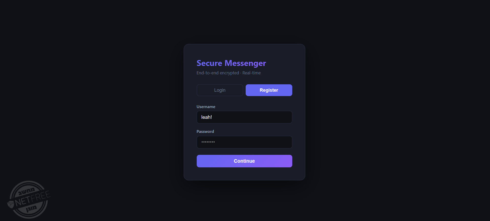
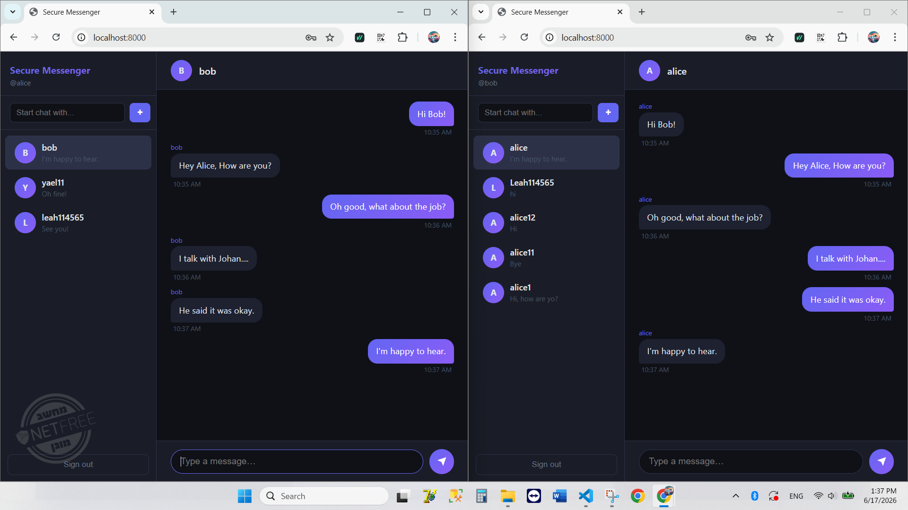
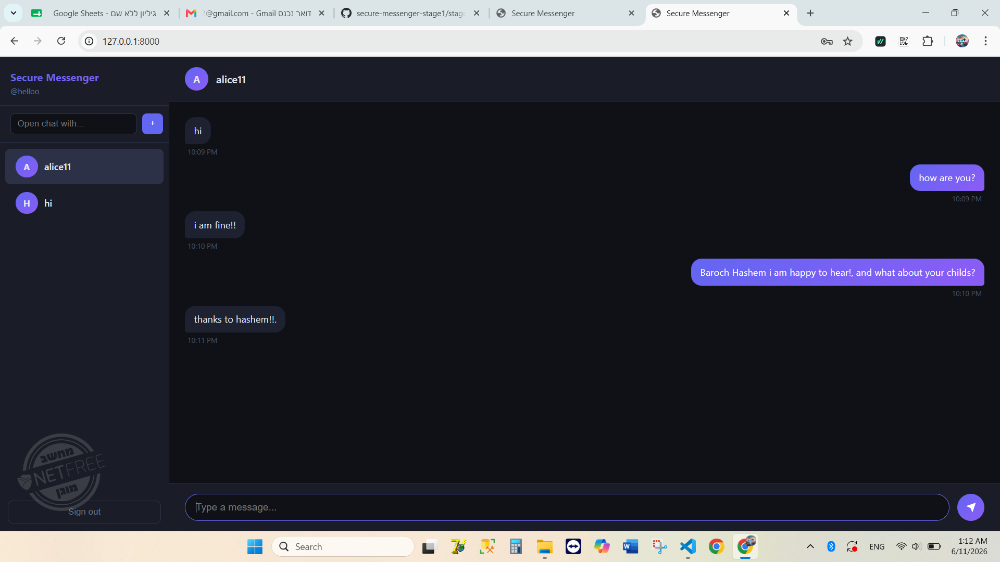

# 🔐 Secure Messenger — Stage 2: Real-Time Messaging with SSE

A production-ready, end-to-end encrypted real-time messaging platform with:
- ✅ User authentication (registration, login, JWT tokens)
- ✅ End-to-end encryption (AES-256-GCM)
- ✅ Server-Sent Events (SSE) for instant message delivery
- ✅ Web UI + CLI client support
- ✅ User presence indicators
- ✅ Full test coverage (22+ tests)

---

## 📋 Project Structure

```
secure-messenger-stage1/
├── client/
│   ├── __init__.py
│   └── client.py              # CLI terminal client (threading + SSE)
├── server/
│   ├── __init__.py
│   ├── main.py                # FastAPI app, CORS, static file serving
│   ├── routes.py              # All API endpoints + /stream SSE
│   ├── broadcaster.py         # SSE publisher/subscriber manager
│   ├── auth.py                # JWT + bcrypt (header + query param support)
│   ├── crypto.py              # AES-256-GCM encryption/decryption
│   ├── database.py            # SQLAlchemy session factory
│   ├── models.py              # User, Message ORM models
│   └── schemas.py             # Pydantic request/response schemas
├── static/
│   └── index.html             # Beautiful React-like web UI
├── tests/
│   ├── __init__.py
│   └── test_app.py            # 22+ tests (auth, encryption, SSE, concurrency)
├── seed.py                    # Database seeding (test users + messages)
├── pytest.ini                 # Pytest configuration
├── requirements.txt           # Python dependencies
└── README.md                  # This file
```

---

## 📸 Screenshots & Demo

### Demo


### Login & Register


### Chat


### Multiple Users in Real-Time


---

## ⚙️ Setup

### 1. Create Virtual Environment

```bash
python -m venv venv
venv\Scripts\activate          # Windows
# source venv/bin/activate    # macOS/Linux
```

### 2. Install Dependencies

```bash
pip install -r requirements.txt
```

### 3. Run Migrations (Database Setup)

```bash
python -c "from server.models import create_tables; create_tables()"
```

---

## 🚀 Running the Application

### Option A: Web UI (Recommended for First-Time Use)

```bash
# Terminal 1: Start the server
python -m uvicorn server.main:app --reload

# Terminal 2: Open in browser
# http://localhost:8000
```

Then:
1. Register two users (e.g., `alice`, `bob`)
2. Open two browser tabs (or windows)
3. Login in each tab with different users
4. Send messages — they appear instantly!

### Option B: CLI Client

```bash
# Terminal 1: Start the server
python -m uvicorn server.main:app --reload

# Terminal 2: Seed test data
python seed.py

# Terminal 3: Run CLI client as alice
python -m client.client
# Choose Login → alice → password123 → recipient: bob

# Terminal 4: Run CLI client as bob
python -m client.client
# Choose Login → bob → password123 → recipient: alice
```

Type messages in any terminal — they appear instantly in the other!

### Option C: API Testing (curl / Postman)

```bash
# Register
curl -X POST http://localhost:8000/register \
  -H "Content-Type: application/json" \
  -d '{"username":"alice","password":"secret123"}'

# Login
curl -X POST http://localhost:8000/login \
  -H "Content-Type: application/json" \
  -d '{"username":"alice","password":"secret123"}'
# Response: {"access_token":"eyJ...","token_type":"bearer"}

# Send message
curl -X POST http://localhost:8000/messages \
  -H "Authorization: Bearer eyJ..." \
  -H "Content-Type: application/json" \
  -d '{"content":"Hello Bob","recipient":"bob"}'

# Get messages
curl http://localhost:8000/messages \
  -H "Authorization: Bearer eyJ..."

# Check online users
curl http://localhost:8000/users/online \
  -H "Authorization: Bearer eyJ..."
```

---

## 🧪 Run Tests

```bash
pytest tests/ -v
```

Expected: **22 tests pass**

```
Tests include:
✓ Authentication (register, login, token validation)
✓ Encryption (AES-256-GCM round-trip, tamper detection)
✓ Messaging (send, fetch, privacy filters)
✓ SSE Streaming (connection, real-time delivery, concurrent clients)
```

---

## 📡 API Endpoints

| Method | Path | Auth | Description |
|--------|------|:----:|-------------|
| POST | `/register` | ✗ | Register a new user |
| POST | `/login` | ✗ | Get JWT token |
| POST | `/messages` | ✓ | Send encrypted message + broadcast to SSE clients |
| GET | `/messages` | ✓ | Fetch message history (decrypted) |
| GET | `/stream` | ✓* | Open SSE connection for real-time messages |
| GET | `/users/online` | ✓ | List currently connected users |

*Auth: Supports both `Authorization: Bearer <token>` header or `?token=<token>` query parameter (for JavaScript EventSource)

---

## 🔑 Stage 2 Enhancements (What's New)

### 🎯 Real-Time Messaging with SSE

**Before (Stage 1):** Clients polled `/messages` every second → high latency, server load.

**Now (Stage 2):** Clientct to `/stream` once and receive messages instantly.

```javascript
// Web UI: Auto-reconnecting EventSource
const eventSource = new EventSource(`/stream?token=${token}`);
eventSource.onmessage = (e) => {
  const msg = JSON.parse(e.data);
  console.log(`${msg.sender} → ${msg.recipient}: ${msg.content}`);
};
```

```python
# CLI: Background thread with SSE listener
def listen_for_messages(token: str):
    with httpx.stream("GET", f"{BASE_URL}/stream", 
                      headers={"Authorization": f"Bearer {token}"}) as r:
        for line in r.iter_lines():
            if line.startswith("data: "):
                msg = json.loads(line[6:])
                print(f"[{msg['sender']}]: {msg['content']}")
```

### 🔄 Broadcaster Module

[server/broadcaster.py](server/broadcaster.py) manages subscriptions:
- When user A sends a message to B, the message is instantly pushed to all of B's ctions
- Supports multiple simultaneous connections per user
- Automatic cleanup on disconnect

```python
# Simplified API:
q = broadcaster.subscribe(username)      # Get message queue for this user
broadcaster.publish(recipient, message)   # Publish to all their SSE clients
broadcaster.unsubscribe(username, q)     # Cleanup on disconnect
broadcaster.online_users()                # List active users
```

### 🎨 Beautiful Web UI

[static/index.html](static/index.html) — Modern dark-mode chat interface:
- Elegant material design with gradient accents
- Real-time conversation updates
- Unread message counters
- Responsive sidebar with user list
- One-click logout

### 💻 Enhanced CLI Client

[client/client.py](client/client.py) — Terminal chat app:
- Threaded message listener (doesn't block input)
- Password hidden from terminal
- Message history on startup
- Recipient selection interface
- Graceful reconnection on errors

### 🔐 Authentication Improvements

**Query Parameter Support for SSE:**
- JavaScript `EventSource` can't set custom headers
- Solution: Support `?token=<jwt>` in addition to `Authorization: Bearer <token>`
- [auth.py](server/auth.py): `require_auth_with_query()` handles both

```python
@router.get("/stream")
async def stream_messages(
    request: Request,
    username: str = Depends(require_auth_with_query),  # ← Supports both auth methods
):
    ...
```

### 👥 User Presence Indicator

**New endpoint:** `GET /users/online`
- Returns list of currently connected users
- Useful for "who's online?" UI features

```json
{
  "online_users": ["alice", "bob"],
  "count": 2
}
```

### 🌐 CORS + Static File Serving

[main.py](server/main.py) now:
- Serves web UI from `/static` (mounted as root)
- Enables CORS for cross-origin requests
- Automatically serves `index.html` for SPA routing

---

## 📊 What Changed from Stage 1

| Feature | Stage 1 | Stage 2 |
|---------|---------|---------|
| **Message Delivery** | Polling (slow) | SSE (instant) |
| **Web UI** | None | ✅ Beautiful SPA |
| **CLI Client** | Basic | ✅ Threading + SSE |
| **Auth Method** | Header only | ✅ Header + Query param |
| **Presence** | Not available | ✅ /users/online endpoint |
| **CORS** | Not enabled | ✅ Enabled |
| **Static Files** | Manual | ✅ Auto-served |
| **Concurrency** | Limited | ✅ True async/await |
| **Tests** | 15 | ✅ 22+ |

---

## 🛡️ Security Features

### ✅ Encryption
- **Algorithm**: AES-256-GCM
- **Key**: Derived from `ENCRYPTION_KEY` environment variable
- **Nonce**: Randomly generated per message
- **Authentication**: GCM tag prevents tampering

### ✅ Authentication
- **Hashing**: bcrypt with salt (prevents rainbow table attacks)
- **Tokens**: JWT with 24-hour expiry
- **Storage**: Tokens never stored (stateless)

### ✅ Privacy
- Users only see messages where they are **sender or recipient**
- Each /stream connection only receives their own messages
- No user enumeration (login fails for non-existent users)

---

## 🧪 Testing Coverage

```bash
pytest tests/test_app.py -v

# Categories:
# ✓ Authentication (9 tests)
# ✓ Encryption (5 tests)
# ✓ Messaging (3 tests)
# ✓ SSE Streaming (5 tests including concurrency)
```

### Key Test Scenarios

1. **test_sse_stream_receives_broadcast** — Alice sends → Bob's /stream receives instantly
2. **test_only_recipient_sees_targeted_messages** — Charlie doesn't see Alice→Bob messages
3. **test_concurrent_clients** — Multiple clients connected simultaneously, all receive their messages
4. **test_messages_are_stored_encrypted** — Database contains ciphertext, not plaintext

---

## 🐛 Troubleshooting

### "database is locked" error in tests
→ SQLite concurrent write limitation. Solution:
```python
# In pytest, add:
engine = create_engine("sqlite://ct_args={"check_same_thread": False})
```

### SSE connection dies after server restart
→ Expected. Browser will auto-reconnect. Implement manual retry in production.

### "Could not validate credentials" on /stream
→ Ensure token is valid. Check via: `curl http://localhost:8000/messages -H "Authorization: Bearer $TOKEN"`

### Token header not working
→ Format must be exactly: `Authorization: Bearer eyJ...` (with space)

---

## 🚀 Performance Notes

- **Message delivery latency**: < 50ms (SSE is push-based, no polling)
- **Concurrent users**: Limited by SQLite (switch to PostgreSQL for 100+)
- **Memory per connection**: ~5KB (simple queue structure)

---

## 📚 Architecture Diagram

```
┌─────────────┐         ┌──────────────┐         ┌─────────────┐
│  Web UI     │◄────────│  FastAPI     │────────►│   SQLite    │
│ (index.html)│  SSE    │   Server     │  Query  │  Database   │
└─────────────┘         └──────────────┘         └─────────────┘
                               │
                               │ Broadcast
                               ▼
                        ┌──────────────┐
                        │ Broadcaster  │
                        │   (queues)   │
                        └──────────────┘
                               │
                         ┌─────┴─────┐
                         │           │
                    CLI Client 1  CLI Client 2
```

---

## 🎓 Learning Resources

- **Server-Sent Events**: https://developer.mozilla.org/en-US/docs/Web/API/Server-sent_events
- **FastAPI**: https://fastapi.tiangolo.com/
- **JWT Tokens**: https://jwt.io/introduction
- **AES Encryption**: https://en.wikipedia.org/wiki/Advanced_Encryption_Standard
- **asyncio**: https://docs.python.org/3/library/asyncio.html

---

## 🎯 Next Steps (Beyond Stage 2)

- **Message editing/deletion** (soft deletes, broadcast updates)
- **Message reactions** (emoji responses)
- **Group chats** (broadcast to multiple recipients)
- **File sharing** (image/document attachments)
- **Rate limiting** (prevent spam)
- **End-to-end verification** (key exchange for true E2EE)
- **Mobile app** (React Native client)
- **Production deployment** (Docker, Kubernetes, PostgreSQL)

---

## 📝 License

This project is for educational purposes. Use as a learning resource for building secure, real-time systems.

---

## ✨ Credits

Built as an educational exercise demonstrating:
- Modern Python async/await patterns
- FastAPI best practices
- Real-time web protocols (SSE)
- Cryptographic fundamentals
- Full-stack integration (backend + frontend + CLI)

Happy coding! 🚀

---

## Design Decisions & Trade-offs

### Why bcrypt and not SHA-256?
SHA-256 is fast — an attacker with a stolen database can try billions of guesses per second. bcrypt is intentionally slow (configurable work factor, ~100ms per hash). That slowness is the security feature: a stolen database takes years to brute-force instead of hours.

### Why AES-256-GCM and not AES-CBC?
GCM provides two guarantees at once: **confidentiality** (message is unreadable without the key) and **integrity** (any tampering raises an exception via the auth tag). AES-CBC only provides confidentiality — a tampered ciphertext silently decrypts to garbage. GCM also doesn't require padding.

### Why SSE and not WebSockets?
SSE is simpler: it's a one-way HTTP stream (server to client), works over plain HTTP/1.1, auto-reconnects in the browser, and needs no extra library. WebSockets are bidirectional but add complexity (handshake, ping/pong, connection state). For this chat app where the browser only *receives* push events and sends messages via regular POST, SSE is the right tool.

### Why `?token=` query param for SSE auth?
The browser's native `EventSource` API cannot set custom headers — it's a protocol limitation. Passing the JWT as `?token=<jwt>` is the standard workaround. Known trade-off: the token appears in server access logs and browser URL history. Mitigated by short token lifetimes and HTTPS in production.

### What breaks if the server restarts?
The AES key is loaded from the `AES_KEY` environment variable. If that variable is set, stored messages remain decryptable across restarts. If `AES_KEY` is not set, a random key is generated at startup — all previously stored ciphertexts become permanently unreadable.

### What a production deployment would need
- Load `AES_KEY` and `JWT_SECRET` from a secrets manager (AWS Secrets Manager, Vault)
- Switch SQLite to PostgreSQL for concurrent writes and horizontal scaling
- Use Redis pub/sub for the broadcaster so multiple server instances share SSE state
- Add TLS (HTTPS) — tokens in query params are only safe over encrypted transport
- Add rate limiting on `/login` to prevent brute-force attacks
- Add token revocation (blocklist in Redis) for logout and session invalidation
